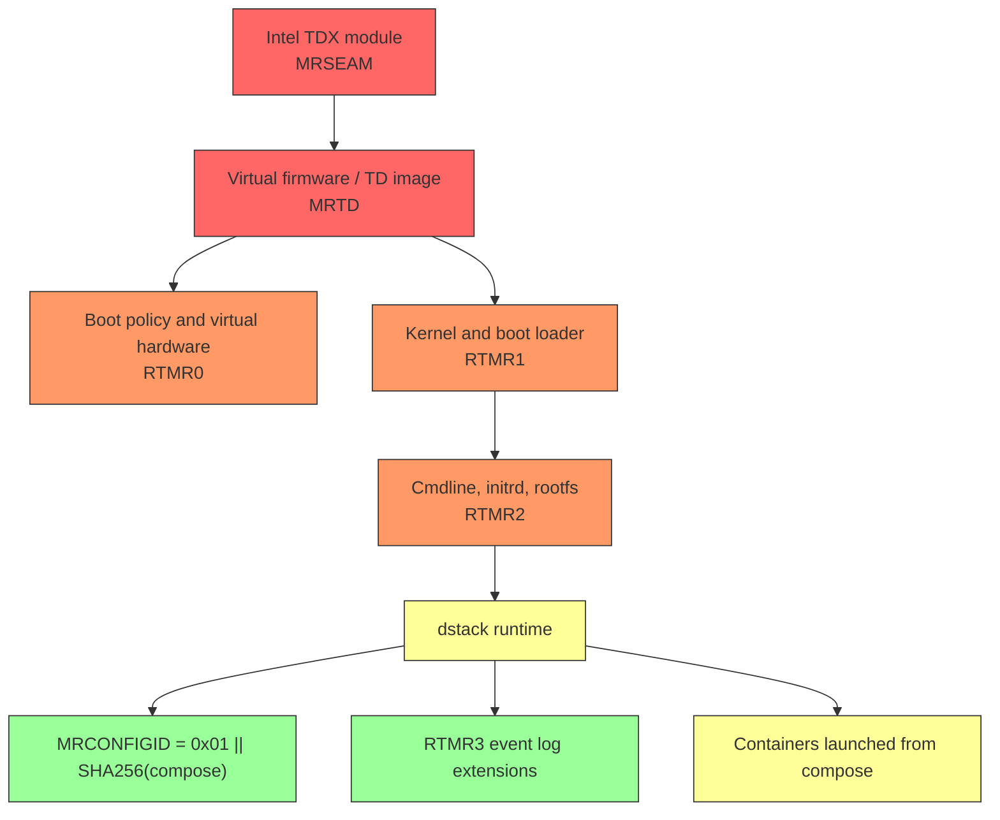

# Dstack Integrity Chain Issues

Many dstack-based inference providers already publish two useful artifacts with their attestation responses:

- a TDX quote
- a Docker Compose manifest bound into `MRCONFIGID`

That is enough for teep to prove that the attested CVM declared a specific compose file, but it is **not** enough to prove that the CVM booted the expected dstack OS image, ran the expected kernel and root filesystem, and then faithfully executed that compose file.

The missing piece is the base-image trust chain:

- `MRSEAM` for the Intel TDX module version
- `MRTD` for the TD virtual firmware image
- `RTMR0`, `RTMR1`, and `RTMR2` for the measured boot configuration, kernel, initrd, and root filesystem

Without published golden values for those registers, teep can verify application-layer binding, but it cannot verify the full dstack boot process. For a security product, that is a high-severity residual risk: a malicious lower stack can declare it is using the expected compose config hash while actually running different code.

## Affected teep validation factors

Base-image measurement enforcement:

- **`tdx_quote_structure`** — enforces `MRTD` and `MRSEAM` allowlists for the
    inference CVM when `mrtd_allow` and `mrseam_allow` are configured
- **`gateway_tdx_quote_structure`** — enforces `MRTD` and `MRSEAM` allowlists
    for the gateway CVM when `gateway_mrtd_allow` and `gateway_mrseam_allow`
    are configured

Measured-boot and runtime replay enforcement:

- **`event_log_integrity`** — replays the inference CVM event log and enforces
    `RTMR0`-`RTMR3` allowlists when configured; this gap exists when providers do
    not publish authenticated baselines for `RTMR0`-`RTMR2`
- **`gateway_event_log_integrity`** — replays the gateway CVM event log and
    enforces `gateway_rtmr0_allow`-`gateway_rtmr3_allow`; this gap exists when
    providers do not publish authenticated gateway baselines for `RTMR0`-`RTMR2`

Application-layer factors that remain necessary but are not sufficient:

- **`compose_binding`** — proves `MRCONFIGID` matches the published
    `app_compose`, but does not authenticate the underlying dstack boot image,
    kernel, or root filesystem
- **`gateway_compose_binding`** — gateway equivalent of `compose_binding`; it
    can pass even when the gateway lower stack is not independently authenticated

---

## TDX in One Page

Intel TDX does not know what Docker Compose is. It does not pull container images, parse YAML, or orchestrate workloads. TDX does one narrower but critical job: it measures VM state and produces a hardware-signed quote containing those measurements.

The key registers are:

- `MRSEAM`: identity of the Intel TDX module
- `MRTD`: measurement of the initial TD image, effectively the virtual firmware root of trust
- `RTMR0`: measured hardware and boot-policy configuration
- `RTMR1`: measured kernel and boot-loader state
- `RTMR2`: measured kernel command line, initrd, root filesystem related state
- `RTMR3`: runtime and application-layer events, replayable from the event log
- `MRCONFIGID`: 48-byte configuration field included in the quote
- `REPORTDATA`: caller-bound cryptographic binding field used for nonce and key binding

The security meaning of those fields is not symmetric:

- `MRSEAM`, `MRTD`, and `RTMR0-2` establish whether the **platform and guest boot chain** are trustworthy
- `RTMR3` and `MRCONFIGID` establish whether **runtime metadata and app configuration** match what dstack reported

This distinction is the core of the gap. A correct `MRCONFIGID` does not compensate for an unverified `MRTD` or `RTMR1`.

## Full Dstack TDX Authentication

dstack’s attestation model is documented in the upstream [dstack attestation guide](https://github.com/Dstack-TEE/dstack/blob/master/attestation.md) and in Phala’s operator-facing documentation, including [Trust Center Technical Details](https://docs.phala.com/dstack/trust-center-technical) and [Verify the Platform](https://docs.phala.com/phala-cloud/attestation/verify-the-platform).

The intended verification story is:

1. build or reproduce the dstack base image
2. derive golden values for `MRTD`, `RTMR0`, `RTMR1`, and `RTMR2` for a specific deployment shape
3. identify the expected `MRSEAM` for the deployed TDX module version
4. verify the quote against those golden values
5. replay the event log to validate `RTMR3`
6. verify that `MRCONFIGID` binds the published compose manifest to the attested TD

In other words, dstack attestation is meant to combine **base-image measurements** and **runtime/application measurements**. The compose file is only one input into that larger chain.

The trust chain looks like this:



If teep verifies only the green part of that chain, it is trusting the yellow and orange parts without evidence.

That creates several realistic failure modes:

- a modified TDX module could report quote contents that look valid enough for policy unless `MRSEAM` is pinned
- a substituted firmware image could boot a different kernel while preserving the expected runtime metadata unless `MRTD` is pinned
- a modified kernel or root filesystem could lie about orchestration behavior while still emitting the expected compose hash unless `RTMR0-2` are pinned
- a malicious runtime could set `MRCONFIGID` to the expected compose hash and extend `RTMR3` consistently while running different code

For teep, the consequence is direct: confidential traffic could be forwarded to a TD whose application metadata looks right, but whose lower stack is untrusted.

## Teep Dstack Verification

When a provider supplies a quote, event log, and compose manifest, teep does several meaningful checks:

- verify the TDX quote structure and PCS collateral
- verify caller binding through `REPORTDATA` where the provider-specific protocol supports it
- verify `MRCONFIGID` against the published compose manifest
- replay the event log and check `RTMR3` consistency
- inspect compose-listed images and apply repository allowlists and supply-chain checks such as Sigstore and Rekor

Those controls matter. They provide application-layer assurance and supply-chain visibility for the images named in the compose file.

However, if the provider does **not** publish golden values for `MRSEAM`, `MRTD`, `RTMR0`, `RTMR1`, and `RTMR2`, teep cannot actually ensure that the docker compose file is actually used: an attacker with hypervisor-level control could preserve the expected compose binding while substituting the firmware, kernel, initrd, or root filesystem.

### What Providers Must Publish

To let teep authenticate the full dstack boot process, providers need to publish enough information for an operator or client to independently validate both the base image and the workload layer.

At minimum, a provider should publish:

1. the dstack OS or equivalent CVM image version used in production
2. the CPU and RAM configuration for each deployment class, because these affect `RTMR0`
3. the expected TDX module version and corresponding `MRSEAM`
4. golden values for `MRTD`, `RTMR0`, `RTMR1`, and `RTMR2` for each supported deployment class
5. the event-log format and any runtime identifiers needed to interpret `RTMR3`
6. the raw `app_compose` manifests for both gateway and model CVMs where both exist
7. the image digests and provenance expectations for every compose-listed component image

That publication set lets teep treat the quote as a full chain-of-trust object rather than an application metadata carrier.

## Recommended Publication Model

The cleanest approach is to publish a signed, versioned measurement manifest alongside the compose and image provenance materials.

### Recommended Manifest Contents

Each manifest should be immutable and scoped to a concrete deployment class, for example a specific gateway image version or inference image version with a fixed CPU and RAM profile.

A practical manifest should include:

- provider name and environment
- deployment role: gateway, inference, or both
- dstack base-image version or source revision
- TDX module version
- CPU count and memory size
- `MRSEAM`
- `MRTD`
- `RTMR0`
- `RTMR1`
- `RTMR2`
- expected event-log schema or version
- `app_compose` digest
- compose-listed image digests and repository identities
- issuance timestamp, validity period, and replacement version

### Recommended Authentication Mechanism

To fit teep’s existing supply-chain posture, providers should publish that manifest in the same style they publish compose-listed images:

1. sign the manifest with Sigstore
2. record it in Rekor
3. host it at a stable versioned location or API endpoint

This mirrors the provenance model already used for container images. teep can then verify:

- the manifest was issued by the expected provider identity
- the manifest has not been tampered with
- the manifest version corresponds to the compose and image digests being attested

If Sigstore is not practical, the next-best option is a provider-signed JSON manifest served from a stable HTTPS endpoint with a pinned signing identity. What matters is that the measurement baselines are authenticated, versioned, and machine-readable.

### How teep Would Use Published Manifests

With authenticated measurement manifests in place, teep could:

1. fetch the provider’s measurement manifest for the declared deployment class
2. verify the manifest signature and provenance
3. load the manifest’s `MRSEAM`, `MRTD`, and `RTMR0-2` values into policy allowlists
4. compare the attested quote fields against those exact values
5. replay the event log for `RTMR3`
6. verify `MRCONFIGID` against the raw compose file
7. verify dstack base and compose-listed images against repository policy and Sigstore/Rekor expectations
8. block the request if any link in that chain fails

That is the end state teep needs: fail-closed verification of both the **boot image** and the **application payload**.

## Practical Recommendations

For providers:

1. publish reproducible build guidance or immutable references for the dstack base image
2. publish per-deployment-class golden values for `MRSEAM`, `MRTD`, and `RTMR0-2`
3. publish those values in a signed, versioned machine-readable manifest
4. bind that manifest to the same release lifecycle as the compose file and component image digests
5. document how rollouts and measurement rotation work so verifiers can safely accept old and new values during controlled upgrades

For builders using teep:

1. treat compose binding as necessary but insufficient
2. where providers do not publish authenticated baselines, pin the currently observed measurement values in teep policy for both inference and gateway hosts using `mrseam_allow`, `mrtd_allow`, `rtmr0_allow`, `rtmr1_allow`, `rtmr2_allow`, and the corresponding `gateway_mrseam_allow`, `gateway_mrtd_allow`, `gateway_rtmr0_allow`, `gateway_rtmr1_allow`, `gateway_rtmr2_allow` settings
3. treat that pinning workflow as a stopgap that detects unexpected measurement drift, not as proof of private inference, because observed values are only truly trustworthy when they come from a reproducibly built and independently verifiable image
4. require provider-published measurement manifests before claiming full dstack integrity

---

## Research Findings: Publicly Available Golden Values

Investigation of GitHub source code, release artifacts, and third-party verifiers
reveals that several register values **can** be determined from public sources
today, even though neardirect and nearcloud do not explicitly publish them.

### MRSEAM: Fully Determinable from Intel Releases

Intel publishes MRSEAM hashes directly in their official TDX module release
notes at `intel/confidential-computing.tdx.tdx-module`. The observed MRSEAM
values in teep's captured attestation data map to specific Intel releases:

| MRSEAM | TDX Module Version | Platform | Observed In |
|--------|-------------------|----------|-------------|
| `49b66faa451d19eb...` | **1.5.08** | Sapphire/Emerald Rapids | neardirect, venice |
| `7bf063280e94fb05...` | **1.5.16** | Sapphire/Emerald Rapids | nanogpt (nearcloud) |
| `476a2997c62bccc7...` | **2.0.08** | Granite Rapids | (not yet observed) |
| `685f891ea5c20e8f...` | **2.0.02** | Granite Rapids | (not yet observed) |
| `5b38e33a64879589...` | **1.5.05** | Sapphire/Emerald Rapids | (Phala docs, older) |

The complete list of MRSEAM-to-version mappings is available from Intel's
release pages. Tinfoil (`tinfoilsh/tinfoil-python`) also maintains a curated
list of accepted MRSEAM values with version labels.

**Implication for teep:** MRSEAM can be pinned today using Intel-published
values. A reasonable policy is to allow the set of non-deprecated 1.5.x+2.0.x
module versions. This does not require any provider cooperation.

### MRTD: Deterministic Per Dstack Image Version

All captured attestation data across neardirect, venice, and nanogpt (nearcloud)
share a single MRTD value:

```
b24d3b24e9e3c16012376b52362ca09856c4adecb709d5fac33addf1c47e193da075b125b6c364115771390a5461e217
```

This value appears in 34 GitHub repositories, including dstack's own verifier
fixtures and the Atlas aTLS library's production examples. The Atlas
`BOOTCHAIN-VERIFICATION.md` documents that this MRTD is produced by running
`dstack-mr measure` against the **dstack-nvidia-0.5.4.1** release from
`nearai/private-ml-sdk`.

MRTD is deterministic for a given dstack OS image version because it measures
only the virtual firmware (OVMF) binary — it does not vary with CPU count,
memory, or GPU configuration.

**Implication for teep:** MRTD can be computed from the reproducibly-built
dstack image using the `dstack-mr` tool from the dstack repository. The current
value can also be pinned by observation since it is consistent across all
providers sharing the same dstack version. When the dstack image is updated,
the new MRTD can be re-derived.

### RTMR0: Per-Deployment-Class (CPU/RAM/GPU Configuration)

RTMR0 measures the virtual hardware configuration (vCPU count, memory size, PCI
hole, GPU count, NVSwitch count, hotplug, QEMU version). Three distinct values
were observed across all captures:

| RTMR0 | Observed In |
|-------|-------------|
| `bc122d143ab76856...` | neardirect, nanogpt/glm-4.7, glm-5 |
| `6ffe4a2c12f07ecc...` | nanogpt/gemma-3-27b, glm-4.7-flash, gpt-oss-120b, and 3 more |
| `0cb94dba1a977341...` | venice, nanogpt/qwen3-30b |

The Atlas `BOOTCHAIN-VERIFICATION.md` explains that RTMR0 varies with hardware
configuration and must be computed per-deployment-class using `dstack-mr
measure --cpu N --memory SIZE --num-gpus G ...`.

**Implication for teep:** RTMR0 cannot be derived without knowing the exact
hardware configuration of each deployment. Providers must either publish these
values per deployment class, or teep operators must pin observed values.

### RTMR1: Per Kernel Version (2-3 Variants)

RTMR1 measures the Linux kernel binary. Three distinct values were observed:

| RTMR1 | Observed In |
|-------|-------------|
| `c0445b704e4c4813...` | neardirect, venice, most nanogpt models (7 captures) |
| `6e1afb7464ed0b94...` | nanogpt/gemma-3-27b, gpt-oss-20b, qwen2.5-vl (used in Atlas production examples) |
| `920eb831509b58bf...` | nanogpt/gpt-oss-120b only |

The multiple values suggest either different dstack image builds or different
kernel configurations across nearcloud's fleet.

**Implication for teep:** RTMR1 is deterministic for a given dstack image, so
it can be computed via `dstack-mr measure` from the reproducible build artifacts.
The current observed values can be pinned to detect unexpected kernel changes.

### RTMR2: Per Image Metadata (5 Variants)

RTMR2 measures the kernel command line, initrd, and rootfs. Five distinct values
were observed, making it the most variable register. This variation likely
reflects different rootfs configurations for different model deployments.

**Implication for teep:** Like RTMR0, the variation means RTMR2 values must be
either provider-published or observed and pinned per deployment class.

### RTMR3: Replayable from Event Log (Already Verified)

RTMR3 is computed by the dstack runtime from the compose hash, instance ID, key
provider, and other runtime events. Teep already verifies RTMR3 by replaying the
event log, so this register does not have a golden-value gap.

### Recommended teep Policy Configuration

Based on the research, teep can immediately configure the following without
provider cooperation:

**mrseam_allow** — The set of Intel-published MRSEAM values for non-deprecated
TDX module versions:
```
mrseam_allow:
  - "49b66faa451d19ebbdbe89371b8daf2b65aa3984ec90110343e9e2eec116af08850fa20e3b1aa9a874d77a65380ee7e6"  # TDX 1.5.08
  - "7bf063280e94fb051f5dd7b1fc59ce9aac42bb961df8d44b709c9b0ff87a7b4df648657ba6d1189589feab1d5a3c9a9d"  # TDX 1.5.16
  - "476a2997c62bccc78370913d0a80b956e3721b24272bc66c4d6307ced4be2865c40e26afac75f12df3425b03eb59ea7c"  # TDX 2.0.08
  - "685f891ea5c20e8fa27b151bf34bf3b50fbaf7143cc53662727cbdb167c0ad8385f1f6f3571539a91e104a1c96d75e04"  # TDX 2.0.02
```

**mrtd_allow** — The MRTD for the current dstack image version, derivable from
reproducible build or observed:
```
mrtd_allow:
  - "b24d3b24e9e3c16012376b52362ca09856c4adecb709d5fac33addf1c47e193da075b125b6c364115771390a5461e217"  # dstack-nvidia-0.5.4.1
```

**rtmr1_allow** — Observed kernel measurements (stopgap until derivable):
```
rtmr1_allow:
  - "c0445b704e4c48139496ae337423ddb1dcee3a673fd5fb60a53d562f127d235f11de471a7b4ee12c9027c829786757dc"
  - "6e1afb7464ed0b941e8f5bf5b725cf1df9425e8105e3348dca52502f27c453f3018a28b90749cf05199d5a17820101a7"
  - "920eb831509b58bf83a554b5377dd5ce26d3f5182f14d33622ac24c1d343a0fa3c7bde746e55098ca30baf784dfd2556"
```

**rtmr0_allow** and **rtmr2_allow** — Must be populated per deployment class;
pin observed values as a drift-detection measure until providers publish.

### Diagnostic Change

The `buildMetadata` function in `report.go` now includes full hex values
for `mrseam`, `mrtd`, and `rtmr0`-`rtmr3` in every verification report's
metadata section. This makes it straightforward to extract the values needed
for policy configuration from any teep verification run.

### Sources

- Intel TDX Module releases: `intel/confidential-computing.tdx.tdx-module` (GitHub releases with MRSEAM hashes)
- Tinfoil Python verifier: `tinfoilsh/tinfoil-python` (`attestation_tdx.py`, curated MRSEAM list)
- dstack reproducible builds: `Dstack-TEE/meta-dstack` and `nearai/private-ml-sdk` (releases)
- dstack measurement calculator: `dstack-mr` tool in `Dstack-TEE/dstack`
- Atlas aTLS library: `concrete-security/atlas` (`BOOTCHAIN-VERIFICATION.md`, production measurement examples)
- Phala attestation docs: `Phala-Network/phala-docs` (attestation fields reference)
- dstack attestation tutorial: `Dstack-TEE/dstack` (`docs/tutorials/attestation-verification.md`)
