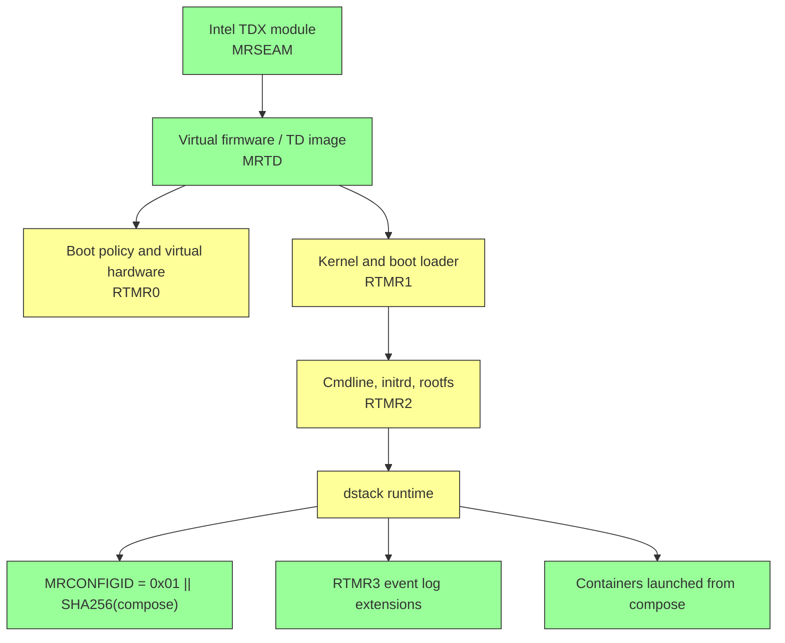

# Dstack Integrity Chain: In-Band Discovery Gap

**Date:** 2025-06-01
**Status:** Open

Dstack-based confidential inference providers do not publish expected boot-chain measurement values in a signed, machine-readable format. Verifiers can enforce measurement allowlists today, but all allowlist values must be sourced and maintained out-of-band. Provider infrastructure changes silently invalidate those values, forcing a choice between strict enforcement with unplanned outages and relaxed enforcement that masks potential compromises.

## The Problem

A TEE attestation proves that the software running inside a confidential VM matches specific measurements. Dstack-based providers produce Intel TDX quotes containing these measurements, and verifiers can check them against expected values. The enforcement machinery works. The problem is operational: no dstack-based provider publishes the expected measurement values in an authenticated, machine-readable channel that verifiers can consume automatically.

Dstack's TDX measurement chain includes registers that identify the firmware, kernel, hardware configuration, and the docker compose manifest of the confidential VM. The application-layer registers (compose manifest binding and runtime event log) can be verified in-band from the attestation evidence itself. The boot-chain registers (firmware, kernel, hardware configuration) must be compared against externally-sourced expected values — and those expected values are what providers do not publish.

In the case of NearAI, the docker compose manifest contents are provided in-line, which allows the container images to be fully authenticated via Sigstore, even if they change dynamically. However, there is no signed release manifest that binds the usage of a specific dstack base image version and hardware configuration to expected current TDX measurement values. Unlike the docker compose manifest, no NearAI API fields provide base dstack or hardware configuration profiles in-band that can be cross-checked in Sigstore.

This creates three operational problems:

1. **Silent breakage.** When a provider updates its dstack image, kernel, or hardware configuration, measurement values change without notice. Strict verifiers fail closed, blocking inference until the operator discovers the change and updates allowlists manually.

2. **Forced trade-off between safety and availability.** Operators must choose between strict enforcement (fail closed on any unexpected value, accepting unplanned outages) and relaxed enforcement (permitting unverified infrastructure changes to pass silently).

3. **No way to distinguish upgrades from compromises.** Bootstrapping allowlist values from observed attestation reports requires trusting the environment at the time of observation. Without an authenticated source, a legitimate provider upgrade and a compromised lower stack both look the same: unexpected measurement drift.

## Impact

No compensating controls exist in the dstack attestation protocol for automated discovery of boot-chain measurement baselines. The compose manifest binding and event log replay provide application-layer verification, but the boot-chain registers that establish platform integrity have no authenticated in-band source.

**Security impact:**

- A compromised lower stack (firmware, kernel, or hypervisor configuration) produces measurements that differ from expected values, but so does a routine provider upgrade. Without an authenticated channel for measurement baselines, verifiers cannot distinguish the two. An attacker who compromises the provider's infrastructure between allowlist updates could operate undetected until the next manual audit.
- Operators who relax enforcement to avoid outages from legitimate provider changes also relax enforcement against actual compromises. The same configuration knob that keeps service running also reduces the security guarantee.

**Operational impact:**

- Strict measurement enforcement causes unplanned outages whenever a provider updates firmware, kernel, or hardware configuration — changes that happen without advance notice.
- Per-deployment-class variation in hardware configuration (CPU count, memory, GPU count) means a fleet with multiple hardware profiles requires multiple pinned values, all maintained manually.
- Providers have no mechanism to announce measurement changes before rolling out infrastructure updates, so verifiers cannot pre-configure new allowlist values.

---

## Technical Background

### TDX Measurement Registers

Intel TDX does not know what Docker Compose is. It does not pull container images, parse YAML, or orchestrate workloads. TDX does one narrower but critical job: it measures VM state and produces a hardware-signed quote containing those measurements.

The key registers are:

| Register | What it measures | What determines its value |
|----------|-----------------|--------------------------|
| `MRSEAM` | Intel TDX module identity | TDX module version and platform generation |
| `MRTD` | Virtual firmware (OVMF) image | Dstack OS image version (deterministic per build) |
| `RTMR0` | Hardware and boot-policy config | vCPU count, memory size, GPU count, QEMU version |
| `RTMR1` | Linux kernel binary | Dstack image build |
| `RTMR2` | Kernel cmdline, initrd, rootfs | Rootfs configuration per deployment |
| `RTMR3` | Runtime events | Compose hash, instance ID, key provider (replayable from event log) |
| `MRCONFIGID` | 48-byte config field | Set by dstack to `0x01 \|\| SHA256(app_compose)` |
| `REPORTDATA` | Caller-bound binding field | Nonce and TLS key binding |

The security meaning of these registers is not symmetric:

- `MRSEAM`, `MRTD`, and `RTMR0`–`RTMR2` establish whether the **platform and guest boot chain** are trustworthy — the firmware, kernel, and hardware configuration that run before any application code
- `RTMR3` and `MRCONFIGID` establish whether **runtime metadata and app configuration** match what dstack reported — the Docker Compose manifest and runtime events

This distinction is the root of the maintenance problem. The application-layer registers (`RTMR3`, `MRCONFIGID`) are verified in-band from the attestation evidence itself. The boot-chain registers (`MRSEAM`, `MRTD`, `RTMR0`–`RTMR2`) must be compared against externally-sourced expected values — and those expected values are what providers do not publish.

### Full Dstack TDX Authentication

Dstack's attestation model layers application-level bindings on top of TDX's hardware measurements. The upstream [dstack attestation guide](https://github.com/Dstack-TEE/dstack/blob/master/attestation.md) and Phala's [Trust Center Technical Details](https://docs.phala.com/dstack/trust-center-technical) and [Verify the Platform](https://docs.phala.com/phala-cloud/attestation/verify-the-platform) documentation describe the intended verification story:

1. build or reproduce the dstack base image
2. derive expected values for firmware and boot-chain registers for a specific deployment shape
3. identify the expected Intel TDX module version
4. verify the quote against those expected values
5. replay the event log to validate runtime measurements
6. verify that the compose manifest is bound to the attested TD

In other words, dstack attestation combines **boot-chain measurements** (is this the right platform?) with **application measurements** (is this the right workload?). The compose file is only one input into that larger chain.

The trust chain looks like this:



Green nodes are either verifiable from authoritative sources (MRSEAM from Intel, MRTD from dstack reproducible release builds, Sigstore docker image signatures) or already verified in-band (MRCONFIGID, RTMR3). Yellow nodes can be pinned from observed attestation reports, but those pins are **out-of-band and fragile** — they break without warning when a provider changes hardware configuration, kernel version, or rootfs layout.

Without measurement allowlists configured, verifiers can check only the green nodes — application-layer bindings and compose-file docker container images. With allowlists configured, the full chain can be enforced, including authentication of dynamic changes to docker compose file images via online Sigstore checks.

But the yellow nodes require externally-sourced expected values, and the lack of an authenticated delivery channel for those values creates the operational tension described in [The Problem](#the-problem) above:

- **Strict pins** cause verifiers to fail closed when a provider changes infrastructure, blocking inference until the operator updates allowlists
- **Relaxed pins** let measurement drift pass silently, potentially masking a lower-stack compromise as a routine update
- **Per-deployment-class variation** in RTMR0 and RTMR2 means a fleet with multiple hardware profiles needs multiple pinned values, all maintained manually

---

## Detailed Gap Analysis

### Publicly Available Golden Values

Investigation of GitHub source code, release artifacts, and third-party verifiers reveals that several register values **can** be determined from public sources today, even though neardirect and nearcloud do not explicitly publish them in-band. This per-register analysis demonstrates exactly where the in-band discovery gap lies.

#### MRSEAM: Fully Determinable from Intel Releases

Intel publishes MRSEAM hashes directly in their official TDX module release notes at `intel/confidential-computing.tdx.tdx-module`. The observed MRSEAM values in teep's captured attestation data map to specific Intel releases:

| MRSEAM | TDX Module Version | Platform | Observed In |
|--------|-------------------|----------|-------------|
| `49b66faa451d19eb...` | **1.5.08** | Sapphire/Emerald Rapids | neardirect, venice |
| `7bf063280e94fb05...` | **1.5.16** | Sapphire/Emerald Rapids | nanogpt (nearcloud) |
| `476a2997c62bccc7...` | **2.0.08** | Granite Rapids | (not yet observed) |
| `685f891ea5c20e8f...` | **2.0.02** | Granite Rapids | (not yet observed) |
| `5b38e33a64879589...` | **1.5.05** | Sapphire/Emerald Rapids | (Phala docs, older) |

The complete list of MRSEAM-to-version mappings is available from Intel's release pages. Tinfoil (`tinfoilsh/tinfoil-python`) also maintains a curated list of accepted MRSEAM values with version labels.

**Implication:** MRSEAM can be pinned today using Intel-published values. A reasonable policy is to allow the set of non-deprecated 1.5.x+2.0.x module versions. This does not require any provider cooperation.

#### MRTD: Deterministic Per Dstack Image Version

All captured attestation data across neardirect, venice, and nanogpt (nearcloud) share a single MRTD value:

```
b24d3b24e9e3c16012376b52362ca09856c4adecb709d5fac33addf1c47e193da075b125b6c364115771390a5461e217
```

This value appears in 34 GitHub repositories, including dstack's own verifier fixtures and the Atlas aTLS library's production examples. The Atlas `BOOTCHAIN-VERIFICATION.md` documents that this MRTD is produced by running `dstack-mr measure` against the **dstack-nvidia-0.5.4.1** release from `nearai/private-ml-sdk`.

MRTD is deterministic for a given dstack OS image version because it measures only the virtual firmware (OVMF) binary — it does not vary with CPU count, memory, or GPU configuration.

**Implication:** MRTD can be computed from the reproducibly-built dstack image using the `dstack-mr` tool from the dstack repository. The current value can also be pinned by observation since it is consistent across all providers sharing the same dstack version. When the dstack image is updated, the new MRTD can be re-derived.

#### RTMR0: Per-Deployment-Class (CPU/RAM/GPU Configuration)

RTMR0 measures the virtual hardware configuration (vCPU count, memory size, PCI hole, GPU count, NVSwitch count, hotplug, QEMU version). Three distinct values were observed across all captures:

| RTMR0 | Observed In |
|-------|-------------|
| `bc122d143ab76856...` | neardirect, nanogpt/glm-4.7, glm-5 |
| `6ffe4a2c12f07ecc...` | nanogpt/gemma-3-27b, glm-4.7-flash, gpt-oss-120b, and 3 more |
| `0cb94dba1a977341...` | venice, nanogpt/qwen3-30b |

The Atlas `BOOTCHAIN-VERIFICATION.md` explains that RTMR0 varies with hardware configuration and must be computed per-deployment-class using `dstack-mr measure --cpu N --memory SIZE --num-gpus G ...`.

**Implication:** RTMR0 cannot be derived without knowing the exact hardware configuration of each deployment. Providers must either publish these values per deployment class, or operators must pin observed values.

#### RTMR1: Per Kernel Version (2-3 Variants)

RTMR1 measures the Linux kernel binary. Three distinct values were observed:

| RTMR1 | Observed In |
|-------|-------------|
| `c0445b704e4c4813...` | neardirect, venice, most nanogpt models (7 captures) |
| `6e1afb7464ed0b94...` | nanogpt/gemma-3-27b, gpt-oss-20b, qwen2.5-vl (used in Atlas production examples) |
| `920eb831509b58bf...` | nanogpt/gpt-oss-120b only |

The multiple values suggest either different dstack image builds or different kernel configurations across nearcloud's fleet.

**Implication:** RTMR1 is deterministic for a given dstack image, so it can be computed via `dstack-mr measure` from the reproducible build artifacts. The current observed values can be pinned to detect unexpected kernel changes.

#### RTMR2: Per Image Metadata (5 Variants)

RTMR2 measures the kernel command line, initrd, and rootfs. Five distinct values were observed, making it the most variable register. This variation likely reflects different rootfs configurations for different model deployments.

**Implication:** Like RTMR0, the variation means RTMR2 values must be either provider-published or observed and pinned per deployment class.

#### RTMR3: Replayable from Event Log (Already Verified)

RTMR3 is computed by the dstack runtime from the compose hash, instance ID, key provider, and other runtime events. Teep already verifies RTMR3 by replaying the event log, so this register does not have a golden-value gap.

### Summary of Per-Register Gap Status

| Register | Derivable From Public Sources? | In-Band Discovery? | Gap Status |
|----------|-------------------------------|-------------------|------------|
| `MRSEAM` | Yes — Intel TDX module releases | No | Closable without provider cooperation |
| `MRTD` | Yes — dstack reproducible builds | No | Closable without provider cooperation |
| `RTMR0` | No — requires hardware config | No | **Open — requires provider publication** |
| `RTMR1` | Yes — dstack reproducible builds | No | Closable without provider cooperation |
| `RTMR2` | No — varies per deployment | No | **Open — requires provider publication** |
| `RTMR3` | N/A — verified in-band | Yes | No gap |
| `MRCONFIGID` | N/A — verified in-band | Yes | No gap |

The core of the gap is `RTMR0` and `RTMR2`: these registers vary per deployment class and cannot be derived without hardware configuration details that providers do not publish. `MRSEAM`, `MRTD`, and `RTMR1` can be pinned from public sources today, though the process is manual and fragile across version changes.

---

## Remediation

### What Providers Should Publish In-Band

Verifiers can enforce measurements today, but the enforcement is only as good as the operator's ability to source and maintain allowlist values. To make this reliable, providers should publish measurement baselines **in-band** as part of their attestation or image metadata, in a format verifiers can consume automatically.

At minimum, a provider should publish:

1. the dstack OS or equivalent CVM image version used in production
2. the CPU and RAM configuration for each deployment class, because these affect `RTMR0`
3. the expected TDX module version and corresponding `MRSEAM`
4. golden values for `MRTD`, `RTMR0`, `RTMR1`, and `RTMR2` for each supported deployment class
5. the event-log format and any runtime identifiers needed to interpret `RTMR3`
6. the raw `app_compose` manifests for both gateway and model CVMs where both exist
7. the image digests and provenance expectations for every compose-listed component image

That publication set would let verifiers automatically resolve and validate measurement baselines instead of relying on operator-maintained pins.

### Implementation Options

#### Option A: Signed Measurement Manifest

The cleanest approach is to publish a signed, versioned measurement manifest alongside the compose and image provenance materials. This is the key missing piece: an authenticated, machine-readable format that verifiers can fetch and verify without operator intervention.

**Manifest contents.** Each manifest should be immutable and scoped to a concrete deployment class, for example a specific gateway image version or inference image version with a fixed CPU and RAM profile. A practical manifest should include:

- provider name and environment
- deployment role: gateway, inference, or both
- dstack base-image version or source revision
- TDX module version
- CPU count and memory size
- `MRSEAM`
- `MRTD`
- `RTMR0`
- `RTMR1`
- `RTMR2`
- expected event-log schema or version
- `app_compose` digest
- compose-listed image digests and repository identities
- issuance timestamp, validity period, and replacement version

**Authentication mechanism.** To fit existing supply-chain verification posture, providers should publish the manifest in the same style they publish compose-listed images:

1. sign the manifest with Sigstore
2. record it in Rekor
3. host it at a stable versioned location or API endpoint

This mirrors the provenance model already used for container images. Verifiers can then confirm:

- the manifest was issued by the expected provider identity
- the manifest has not been tampered with
- the manifest version corresponds to the compose and image digests being attested

If Sigstore is not practical, the next-best option is a provider-signed JSON manifest served from a stable HTTPS endpoint with a pinned signing identity. What matters is that the measurement baselines are authenticated, versioned, and machine-readable.

#### Option B: Tinfoil V3 Model (Existing Implementation)

Tinfoil's V3 attestation format is a concrete implementation of the recommended in-band publication model. Tinfoil's `pri-build-action` GitHub Actions workflow computes expected measurement values for every deployment configuration and publishes them as a signed Sigstore bundle (DSSE in-toto attestation with a `snp-tdx-multiplatform/v1` predicate) in the Rekor transparency log.

Verifiers fetch the Sigstore bundle for the deployment's GitHub repository and tag, verify the DSSE signature against the Sigstore root of trust (Fulcio certificate, SCT, transparency log entry), extract the measurement predicate, and compare every register value against the hardware attestation report. This eliminates the three operational problems identified in [The Problem](#the-problem):

1. **No silent breakage.** Infrastructure changes that produce new measurements also produce new bundles — there is no window where measurements drift without a corresponding update to the verification baseline.

2. **No safety/availability trade-off.** The Sigstore bundle is the canonical source of truth for what measurements to expect. Verifiers enforce exact matches — no manual pinning, no relaxed enforcement needed for boot-chain registers.

3. **Upgrades are distinguishable from compromises.** Measurement baselines are authenticated by Sigstore (bound to a specific GitHub repository, workflow, and tag via Fulcio OIDC identity). A compromised lower stack produces measurements that do not match any published bundle. The distinction is cryptographic, not observational.

In addition to the per-deployment code measurement bundle, Tinfoil publishes a separate Sigstore-attested hardware measurements registry (`tinfoilsh/hardware-measurements`) containing expected MRTD and RTMR0 values for each supported hardware platform. Verifiers cross-check the attested values against this registry as a second verification layer.

Unlike dstack, where RTMR0 varies with CPU/RAM/GPU count and operators must maintain multiple pinned values per deployment class, each Tinfoil Sigstore bundle is scoped to a specific deployment configuration. Changing the hardware profile produces a new bundle. This eliminates the fleet management burden that makes dstack measurement maintenance particularly difficult.

### Deployment Priority

1. **Fastest path (no provider cooperation):** Pin `MRSEAM` from Intel releases, `MRTD` and `RTMR1` from dstack reproducible builds, and `RTMR0`/`RTMR2` from observed values. This is achievable today but fragile across version changes.

2. **Strongest path (provider cooperation):** Adopt a Sigstore-based publication model (Option A or B above). This provides cryptographic authentication of all measurement baselines and eliminates the maintenance burden entirely.

3. **Intermediate path:** Providers publish per-deployment-class golden values at a stable HTTPS endpoint, even without Sigstore signing. This reduces the discovery burden while the authenticated publication mechanism is developed.

### Practical Recommendations

**For providers:**

1. publish measurement baselines in-band as part of image metadata or an API endpoint, in a signed and machine-readable format
2. include per-deployment-class values for `MRSEAM`, `MRTD`, `RTMR0`, `RTMR1`, and `RTMR2`
3. bind baseline publication to the same release lifecycle as the compose file and component image digests
4. announce measurement changes **before** rolling out infrastructure updates, so verifiers can pre-configure new allowlist values
5. publish reproducible build guidance or immutable references for the dstack base image so that `MRTD` and `RTMR1` can be independently derived

**For verifier operators:**

1. configure measurement allowlists using observed values (see [Measurement Allowlists](../measurement_allowlists.md) for details)
2. cross-check `MRSEAM` against Intel-published TDX module releases and `MRTD` against dstack reproducible builds where possible
3. pin `RTMR0`–`RTMR2` from observed values as a drift-detection measure; understand that observed-value pins detect unexpected changes but are not independently verifiable without provider-published hardware configurations
4. treat compose binding as necessary but insufficient on its own
5. when in-band authenticated baselines become available, prefer them over manual pinning

---

## References

- **Intel TDX Module releases:** `intel/confidential-computing.tdx.tdx-module` (GitHub releases with MRSEAM hashes)
- **Tinfoil Python verifier:** `tinfoilsh/tinfoil-python` (`attestation_tdx.py`, curated MRSEAM list)
- **dstack reproducible builds:** `Dstack-TEE/meta-dstack` and `nearai/private-ml-sdk` (releases)
- **dstack measurement calculator:** `dstack-mr` tool in `Dstack-TEE/dstack`
- **Atlas aTLS library:** `concrete-security/atlas` (`BOOTCHAIN-VERIFICATION.md`, production measurement examples)
- **Phala attestation docs:** `Phala-Network/phala-docs` (attestation fields reference)
- **Phala Trust Center:** [Trust Center Technical Details](https://docs.phala.com/dstack/trust-center-technical) and [Verify the Platform](https://docs.phala.com/phala-cloud/attestation/verify-the-platform)
- **dstack attestation guide:** [dstack attestation.md](https://github.com/Dstack-TEE/dstack/blob/master/attestation.md)
- **dstack attestation tutorial:** `Dstack-TEE/dstack` (`docs/tutorials/attestation-verification.md`)

---

## Teep Status

### Current Enforcement

When a provider supplies a quote, event log, and compose manifest, teep performs both application-layer and boot-chain verification:

- verify the TDX quote structure and PCS collateral
- verify caller binding through `REPORTDATA` where the provider-specific protocol supports it
- enforce `MRSEAM` and `MRTD` allowlists when configured (pinnable from Intel and dstack sources respectively)
- enforce `RTMR0`–`RTMR2` allowlists when configured (pinnable from observed reports via `--update-config`)
- verify `MRCONFIGID` against the published compose manifest
- replay the event log and check `RTMR3` consistency
- inspect compose-listed images and apply repository allowlists and supply-chain signature checks via Sigstore and Rekor

This provides meaningful coverage of both the boot chain and the application layer. The limitation is not in teep's enforcement capability but in the **discovery and maintenance** of the values it enforces.

Because providers do not publish authenticated measurement baselines in-band, teep operators must either derive values from source (feasible for `MRSEAM` and `MRTD`, difficult for `RTMR0`–`RTMR2` without hardware specs) or bootstrap them from observation (`teep verify --update-config`). Either way, the operator bears the burden of detecting and responding to legitimate infrastructure changes, with no automated mechanism to distinguish a routine dstack upgrade from a compromised lower stack.

### Recommended Policy Configuration

Based on the research findings, teep can immediately configure the following without provider cooperation:

**mrseam_allow** — The set of Intel-published MRSEAM values for non-deprecated TDX module versions:
```
mrseam_allow:
  - "49b66faa451d19ebbdbe89371b8daf2b65aa3984ec90110343e9e2eec116af08850fa20e3b1aa9a874d77a65380ee7e6"  # TDX 1.5.08
  - "7bf063280e94fb051f5dd7b1fc59ce9aac42bb961df8d44b709c9b0ff87a7b4df648657ba6d1189589feab1d5a3c9a9d"  # TDX 1.5.16
  - "476a2997c62bccc78370913d0a80b956e3721b24272bc66c4d6307ced4be2865c40e26afac75f12df3425b03eb59ea7c"  # TDX 2.0.08
  - "685f891ea5c20e8fa27b151bf34bf3b50fbaf7143cc53662727cbdb167c0ad8385f1f6f3571539a91e104a1c96d75e04"  # TDX 2.0.02
```

**mrtd_allow** — The MRTD for the current dstack image version, derivable from reproducible build or observed:
```
mrtd_allow:
  - "b24d3b24e9e3c16012376b52362ca09856c4adecb709d5fac33addf1c47e193da075b125b6c364115771390a5461e217"  # dstack-nvidia-0.5.4.1
```

**rtmr1_allow** — Observed kernel measurements (stopgap until derivable):
```
rtmr1_allow:
  - "c0445b704e4c48139496ae337423ddb1dcee3a673fd5fb60a53d562f127d235f11de471a7b4ee12c9027c829786757dc"
  - "6e1afb7464ed0b941e8f5bf5b725cf1df9425e8105e3348dca52502f27c453f3018a28b90749cf05199d5a17820101a7"
  - "920eb831509b58bf83a554b5377dd5ce26d3f5182f14d33622ac24c1d343a0fa3c7bde746e55098ca30baf784dfd2556"
```

**rtmr0_allow** and **rtmr2_allow** — Must be populated per deployment class; pin observed values as a drift-detection measure until providers publish.

### Diagnostic Change

The `buildMetadata` function in `report.go` now includes full hex values for `mrseam`, `mrtd`, and `rtmr0`-`rtmr3` in every verification report's metadata section. This makes it straightforward to extract the values needed for policy configuration from any teep verification run.

### With Published Manifests

With authenticated measurement manifests in place, teep could:

1. fetch the provider's measurement manifest for the declared deployment class
2. verify the manifest signature and provenance
3. load the manifest's `MRSEAM`, `MRTD`, and `RTMR0-2` values into policy allowlists
4. compare the attested quote fields against those exact values
5. replay the event log for `RTMR3`
6. verify `MRCONFIGID` against the raw compose file
7. verify dstack base and compose-listed images against repository policy and Sigstore/Rekor expectations
8. block the request if any link in that chain fails

That is the end state teep needs: fail-closed verification of both the **boot image** and the **application payload**, with measurement baselines that update reliably when providers roll out infrastructure changes.

For the Tinfoil V3 model specifically, the `sigstore_code_verified` factor covers the entire boot chain through a single verification step, replacing manual `mrseam_allow`, `mrtd_allow`, and `rtmr0_allow`–`rtmr2_allow` configuration. Dstack providers that adopt a similar Sigstore-based publication model would close the same gap.
